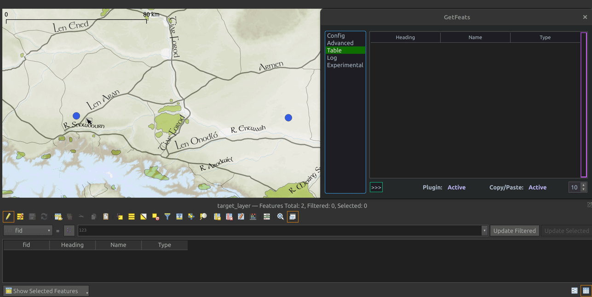
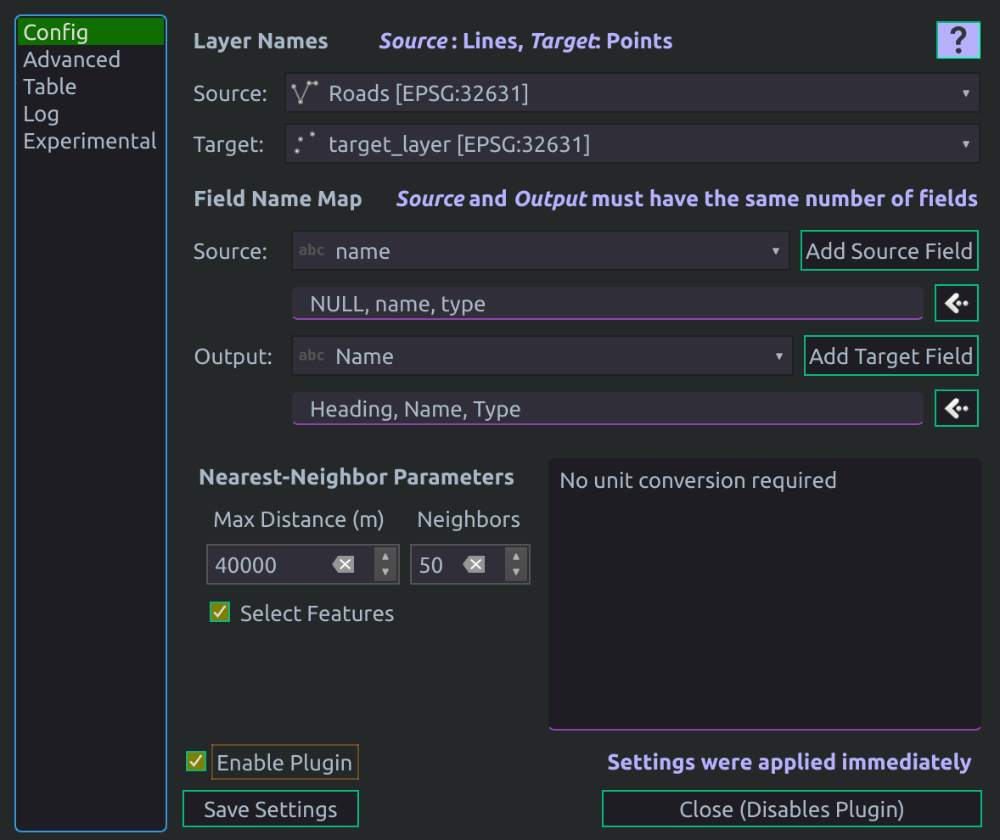
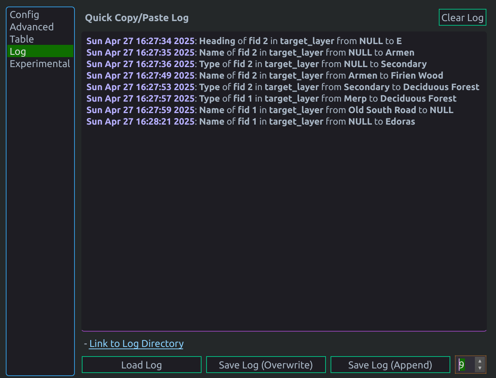

# GetFeats

QGIS plugin - A semi-automation tool. Creates an auto-updating table of feature attributes near a selected point.
 

# Use Case
- Speeds up manual data entry while limiting the risk of typos during feature labeling. Simply copy/paste the correct value.
- When quality assurance (preventing errors) is preferred over quality control (handling errors later).
- When choosing a value from a list is desired, but manual entry may be necessary.

  
  
  **Map Credits**
  - https://github.com/bburns/Arda
  - https://github.com/andrewheiss/ME-GIS

# Installation
## Preferred
### QGIS Plugin Manager
  1. Open QGIS -> Select `Plugins` from the menu bar -> Select `Manage and Install Plugins` -> Select the `All` panel -> Search "GetFeats" -> Click `Install Plugin`
  2. Enable the plugin: Choose the `Installed` panel of `Manage and Install Plugins` and ensure `GetFeats` is checked.

## Alternate methods
### QGIS Plugin Directory
The plugin directory can be found from the QGIS menu bar:
- `Settings` -> `User profiles` -> `Open active profile folder`
-  Defaults (replace *USER* with your username):
    - Windows: `C:\Users\USER\AppData\Roaming\QGIS\QGIS3\profiles\default\python\plugins`
    - Linux: `/home/USER/.local/share/QGIS/QGIS3/profiles/default/python/plugins`
-  After plugin installation it may be necessary to open/restart QGIS and enable the plugin:
    1. Select `Plugins` from the menu bar -> `Manage and Install Plugins` -> `Installed` panel
    2. Ensure `GetFeats` is checked.

### ZIP Download
- Click the `Code` button and select `Download ZIP`. Then follow one of the below methods:
  - Method 1
    1. Extract the contents to a directory named `GetFeats` in the QGIS plugin directory.
  - Method 2
    1. Open QGIS -> Select `Plugins` from the menu bar -> Select `Manage and Install Plugins` -> Select the `Install from ZIP` panel
    2. Choose the downloaded ZIP archive using the file dialog.

### Git
1. Navigate to the QGIS plugin directory, then run:
    - `git clone git@github.com:tetrakai1/GetFeats.git`

# Usage
## Dialog
### Config
  
   
   
   - **Layer Names**
       - The **Source** layer
         - This layer is searched for features nearby a selected **Target** point, the results are then displayed in the [Table](#output-table).
         - Must have *Line* geometry.
       - The **Target** layer
         - A point from this layer is used to select nearby features in the **Source** layer.
         - Must have a *fid* field (this will exist by default if the layer is saved as a geopackage).
         - Must have a *Point* geometry.
   - **Field Name Map**
     - Here the **Source** layer fields are mapped to the **Output** table fields.
       - Both are comma-separated lists.
         - Leading/trailing white space will be stripped out.
       - Values can be selected from the combobox or typed manually.
         - Note that suggestions for the **Output** fields come from the **Target** layer.
       - Last field in the list can be deleted by clicking the `<<<` button. 
       - Results will populate the [Table](#output-table).
     - Source
       - At least one value must be a field in the **Source** layer.
       - Repeated values are allowed.
       - Values not corresponding to a **Source** field will fill that column of the [Table](#output-table).
     - Output
       - These values will be the column names of the [Table](#output-table).
       - Any non-duplicated values are allowed, but there must be the same number as chosen for **Source**.
       - However, if [Quick Copy/Paste](#advanced-config) will be used these should correspond to fields in the **Target** layer.
   - **Nearest-Neighbor Parameters**
     - Max Distance
       - The maximum distance (in meters) from the selected **Target** feature to search for features in the **Source** layer.
       - If no or too few features are found, try increasing this value.     
     - Neighbors
       - Maximum number of neighbors to allow.
         - The final displayed amount will be less in the case of duplicates (ie, features with the same values for attributes listed in the **Source** field map).
         - If too few features are found, there may be many duplicates. Try increasing this value.
     - Select Features
       - Whether to also select the nearest-neighbor features so they are highlighted on the map canvas.
     - Info Box
       - Displays info about unit conversion. In particular, a warning and estimated error will be displayed when converting from degrees to meters.
   - **Enable Plugin**
     - When checked, the plugin will monitor for features selected in the **Target** layer and update the [Table](#output-table).
     - Automatically disabled when the dialog is closed.
   - **Save Settings**
     - Currently displayed settings will be saved to the profile-specific `QGIS.ini` file provided by QGIS. 

### Advanced Config
  
   
   
   - **Enable Quick Copy/Paste**
     - When unchecked, cells in the [Table](#output-table) can be copied by right-clicking or `Ctrl-C`.
       - In this safe mode, the plugin does not modify any existing layer. 
     - When checked, simply clicking a cell in the Table will copy/paste the value into the corresponding field of the selected **Target** feature.
       - This modifies the layer data in the background, so a number of safety measures are taken to avoid accidental copy/pasting.
       - A history of copy/paste events can be found in the [Quick Copy/Paste Log](#quick-copypaste-log).
   - **Use Custom Prep**
     - When checked, additional data preparation is performed (before display in the [Table](#output-table)) as defined by the chosen script from the `custom_prep` directory.
     - This script essentially acts as a plugin-within-a-plugin.
       - A skeleton script and example are included.
       - Typical use cases could be applying regex, or adding a custom field not found in the **Source** layer.
     - The choice must be saved to settings and QGIS restarted to take effect.

### Output Table
  
  

  - **Table**
    - Each row is a feature discovered using the [nearest-neighbor algorithm](#config).
    - Data in each column is an attribute defined in the **Source** list of the [Field Name Map](#config).
    - Column *names* were defined in the **Output** list of the [Field Name Map](#config).
    - Only one cell can be selected at a time.
      - If [Quick Copy/Paste](#advanced-config) is disabled/inactive, values can be copied by right-clicking or `Ctrl-C`.
      - If [Quick Copy/Paste](#advanced-config) is enabled/active, values are auto-copy/pasted when selected.
        - See [Advanced Config](#advanced-config) for the requirements.
  - **Show/Hide Menu**
    - If screenspace is scarce, the menu can be hidden using the button on the bottom-left.
  - **Font Size**
    - The font size can be changed using the spinbox on the bottom-right. 

### Quick Copy/Paste Log
  
  

  - Shows a timestamped history of [Quick Copy/Paste](#advanced-config) activity.
  - If the copy/paste failed, the timestamp will be colored red.
    - Eg, due to attempting to copy a *String* into an *Integer* field.
  - Can be used to:
    - Track the amount of time spent on each feature.
    - Check for errant copy/pastes.
  - Reset the log window by clicking **Clear Log**.
  - Logs can also be saved/loaded from the profile directory.
    - Loaded logs can be distinguished from the current session by lack of colored text.
    - Logs are saved as `qcplog.txt`, manual backup is required to maintain multiple logs.
    - Warnings:
      - **Load Log** overwrites the current log panel.
      - **Save Log (Overwrite)** overwrites the existing log file.
      - **Save Log (Append)** appends to the end of the existing log file.

 
